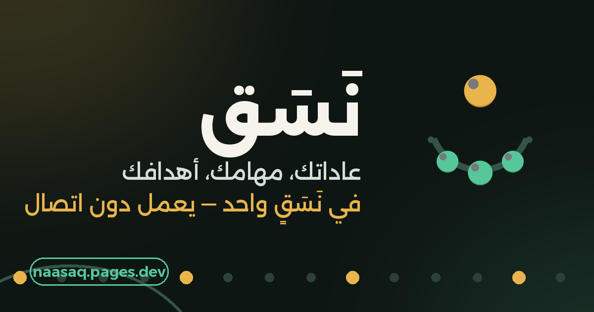
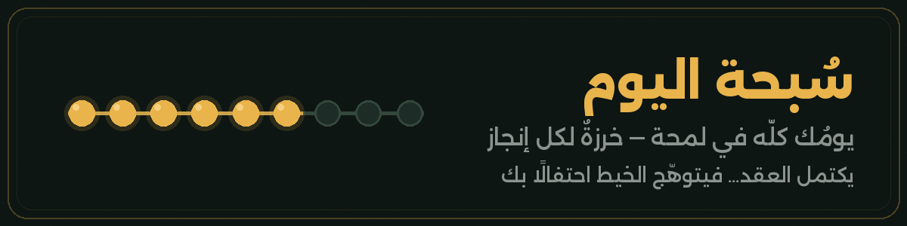
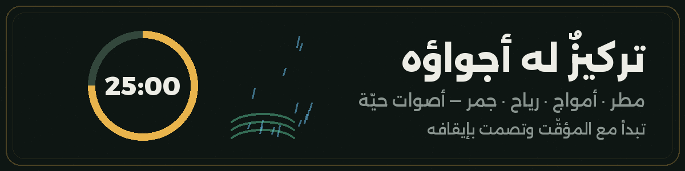
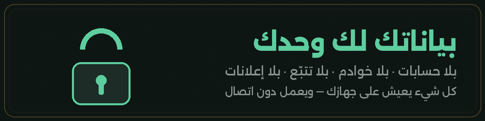

# نَسَق

**يومُك كلّه… في عقدٍ واحد**

عاداتك ومهامك وأهدافك وتركيزك — تطبيق عربي واحد،
يفتح في ثانية، ويعمل بلا إنترنت، وبياناتك لا تغادر جهازك.

 

  

  

  

<a href="#why">لماذا نَسَق</a> · <a href="#misbaha">السُّبحة</a> · <a href="#features">المزايا</a> · <a href="#focus">التركيز</a> · <a href="#install">التثبيت</a> · <a href="#updates">التحديثات</a> · <a href="#privacy">الخصوصية</a> · <a href="#faq">أسئلة</a> · <a href="#log">السجلّ</a>

 

> أدوات الإنتاجية مبعثرة: تطبيق للعادات، وثانٍ للمهام، وثالث للمؤقّت — وكلها بالإنجليزية أو بترجمة باهتة.
> **نَسَق** وُلد ليكون بيتها العربي الواحد: بلا تسجيل، بلا انتظار، بلا شروط.

 

خرزةٌ لكل عادة ومهمة في يومك. أنجِز، فتمتلئ ذهبًا أو ريحانًا — وحين تكتمل آخر خرزة يتوهّج الخيط ويحتفل بك التطبيق. إحساس «أتممتُ يومي» لم يكن يومًا بهذا الوضوح والجمال.

 

## كل ما تحتاجه — ولا شيء لا تحتاجه

<table>
<tr>
<td width="50%" valign="top">

**عاداتٌ تفهمك، لا تحاسبك**

يومية، أو أيام بعينها، أو مرّات في الأسبوع. باللمسة أو بالعدّاد (٨ أكواب ماء؟ لك ذلك). سلاسل لا يكسرها يومك قبل انتهائه، وخريطة حرارية تُريك ثباتك شهورًا. **وفاتك أمس؟** المسه من التفاصيل وسجّله.

</td>
<td width="50%" valign="top">

**مهامٌ بذكاء عربي**

اكتب «مراجعة التقرير غدًا !» فيلتقط الموعد والاستعجال وحده. مصفوفة المهم والعاجل، خطوات فرعية، تكرار يعود بنفسه، بحث حي، ووسوم ملوّنة.

</td>
</tr>
<tr>
<td valign="top">

**أهدافٌ لا تبقى أمنيات**

قسّمها مراحل تُشطب، حدّد موعدها، واربطها بعاداتك اليومية — لترى بعينيك إن كانت خطواتك الصغيرة تمشي نحوها فعلًا.

</td>
<td valign="top">

**رحلةٌ تُكافئك**

نقاط مع كل إنجاز، ١١ مستوى من «بادئ» إلى «نَسَقيّ»، و٢٠ وسامًا تنتظر الفتح. ومزاجُك وسطرُ يومك في يوميات تقرأ عامك لاحقًا كقصة.

</td>
</tr>
<tr>
<td valign="top">

**بطاقة يومك**

لمسة واحدة، فيرسم نَسَق صورة أنيقة تلخّص إنجازك — شاركها أو احفظها ذكرى.

</td>
<td valign="top">

**تذكيراتٌ في وقتها**

لكل عادة وقتها الذي تختاره، فيأتيك التنبيه: «خرزة اليوم بانتظارك — لا تكسر السلسلة».

</td>
</tr>
</table>

 

جلسات عملٍ واستراحة بإيقاعك، ومدد جاهزة بلمسة: <kbd>١٥</kbd> <kbd>٢٥</kbd> <kbd>٤٥</kbd> <kbd>٦٠</kbd> دقيقة. الشاشة تبقى مضيئة، والوقت المتبقي يظهر حتى في عنوان التبويب، **ووضع الغمر** يمحو كل مشتّت. وإن ضاق صدرك: تمرينا تنفّس بكرةٍ تتنفّس معك.

 

## ثبّته في ثلاث لمسات

<table>
<tr>
<td align="center" width="33%"><h3>١</h3>افتح <b><a href="https://naasaq.pages.dev">naasaq.pages.dev</a></b> من متصفحك</td>
<td align="center" width="33%"><h3>٢</h3>اضغط <b>«تثبيت»</b> حين تظهر اللافتة أو من قائمة المتصفح: «إضافة إلى الشاشة الرئيسية»</td>
<td align="center" width="33%"><h3>٣</h3>وجدته على شاشتك تطبيقًا مستقلًا بأيقونته <b>يفتح بلا إنترنت</b></td>
</tr>
</table>

> **والتحديثات تأتيك بنفسها:** حين يجهز جديد يظهر زر «تحديث الآن» — ومعه شاشة «ما الجديد» تشرح كل إضافة.
> مشغول أو بلا اتصال؟ اضغط <kbd>لاحقًا</kbd> وسيعود الزر وحده لحظة عودة الإنترنت.

 

كل حرفٍ تكتبه يعيش على جهازك أنت — ونسخة احتياطية بملفٍ واحد تصدّره من الإعدادات وتستعيده متى وأين شئت. خصوصيتك هنا ليست ميزة… بل أساس البناء.

 

## أسئلة تدور في بالك

<b>هل يحتاج إنترنت؟</b>

 مرة واحدة عند أول فتح فقط. بعدها يعمل كاملًا دون اتصال — والإنترنت لا يلزم إلا لاستقبال التحديثات حين تريدها.

<b>أين تُحفظ بياناتي؟ وكيف أنقلها لجهاز آخر؟</b>

 على جهازك فقط، لا ترحل لأي خادم. للنقل: الإعدادات ← «تصدير نسخة احتياطية» فيهبط ملف واحد، ثم «استيراد» على الجهاز الجديد.

<b>هل تصلني التذكيرات والتطبيق مغلق؟</b>

 بصراحة: تصل ما دام نَسَق مفتوحًا ولو في الخلفية. أُغلق تمامًا؟ ستجد خرزاتك بانتظارك عند العودة — فلا خوادم تلاحقك، وهذا ثمن خصوصيتك الذي نفخر به.

<b>لماذا لا يوجد تسجيل دخول؟</b>

 لأنك لست الـمنتَج. لا حساب يعني لا بريد يُجمع، لا كلمة سر تُسرَّب، ولا «نسيت كلمة المرور» أبدًا.

<b>كم يكلّف؟</b>

 لا شيء. اليوم وغدًا وبعده — بلا إعلانات وبلا اشتراكات وبلا نسخة «مدفوعة».

<b>وعلى iPhone؟</b>

 افتح الرابط في سفاري ← زر المشاركة ← «إضافة إلى الصفحة الرئيسية». نفس التجربة كاملة.

 

## سجلّ الرحلة

<b>الإصدار ١.٣</b> — الحاضر

 

- تسجيل الأيام الماضية للعادات بلمسة — حتى ليومٍ قبل إنشائها
- مدد تركيز سريعة: ١٥ / ٢٥ / ٤٥ / ٦٠
- الوقت المتبقي في عنوان التبويب أثناء الجلسة
- نظام تحديث يعرف حالة اتصالك، قابل للتأجيل، ويشرح كل جديد
- حروف «تركيز» متصلة، وانسيابية أدق في كل مكان

<b>الإصدار ١.٢</b>

 

- بحث حي وتصفية بالوسوم في المهام، وحذف المكتملة دفعة
- بطاقة مشاركة يومك كصورة أنيقة
- الشاشة تبقى مضيئة أثناء التركيز + وضع الغمر
- بطاقة أقرب هدف بموعده في شاشة اليوم

<b>الإصدار ١.١</b>

 

- الأجواء الصوتية ترتبط بالمؤقّت: تعمل معه وتصمت بإيقافه
- فهم أدقّ لـ«غدًا» و«بعد غد» عند إضافة المهام
- ضبط أدقّ للنقاط والمستويات

 

  

صُنع بحُب · <a href="https://instagram.com/x150ll">إنستغرام @x150ll</a> · <a href="https://t.me/x150ll">تيليغرام @x150ll</a>

رخصة MIT — افتح، تعلّم، وشارك

